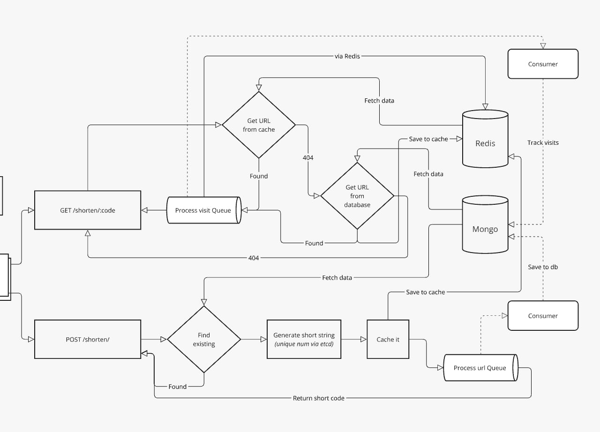

# URL Shortener

## Overview

A URL shortener application, which allows users to create short links for long URLs.

## Prerequisites

To run this project, you will need to have Docker installed on your local machine.

## Features

- API with **distributed** range counters assigned to each instance ensuring zero overlap and efficient distribution of short codes ft. etcd
- Separately **scalable** redirector, api and frontend applications
- Uses Redis for caching data for viable **performance**
- Queues are in-place for **de-coupling** ops
- MongoDB for storing data with future possibility of **horizontal scaling**, and seamless features addition
- End-to-end testing covered by **Cypress**
- Containerization

## Technologies

- [NestJS](https://nestjs.com/) - For building the backend API
  - [Swagger](https://docs.nestjs.com/openapi/introduction) - For API documenation
- [Go](https://golang.org/) - For the redirector app
- [Vite](https://vitejs.dev/) - For building the frontend used to create short links
  - [TailwindCSS](https://tailwindcss.com/) - For styling
  - [React](https://react.dev/) - For building the frontend
- [MongoDB](https://www.mongodb.com/) - For storing the URLs
- [etcd](https://etcd.io/) - For storing range counters for each instance
- [Redis](https://redis.io/) - For caching
- [Cypress](https://www.cypress.io/) - For end-to-end testing
- [Docker](https://www.docker.com/) - For containerization

## Running the project

To start the application, use:

```bash
# For development
docker-compose -f docker-compose.dev.yml up --build

# Mimick production
docker-compose -f docker-compose.prod.yml up --build
```

With default configuration, you can access

- Frontend will be available at [http://localhost:5173](http://localhost:5173)
- API at [http://localhost:3010](http://localhost:3010)
- API Documentation at [http://localhost:3010/api](http://localhost:3010/api)

## Running Tests

To run the `e2e` tests, use:

```bash
docker-compose -f docker-compose.e2e.yml up --build
```

To run the api `unit` tests:

```bash
cd api && npm run test
```

## Tear down

To take down the application containers, use:

```bash
# Development
docker-compose -f docker-compose.dev.yml down

# Production
docker-compose -f docker-compose.prod.yml down

# e2e Test
docker-compose -f docker-compose.e2e.yml down
```

## Ops Flow




## Contributing

Feel free to open issues and pull requests for any improvements or bug fixes.

## License

This project is licensed under the MIT License - see the [LICENSE](LICENSE) file for details.
